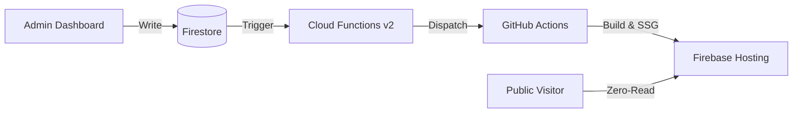

# DojoWeb CMS: High-Performance SSG Architecture

A production-grade content management system and public platform for a Taekwon-Do Dojo, engineered with a focus on **infinite scalability**, **zero-cost public data fetching**, and **Fort Knox security**.

## 🏗️ System Architecture

This project implements a decoupled **SSG (Static Site Generation)** architecture to bypass live database read costs for public users while maintaining a real-time administrative experience.

### Key Engineering Features

#### 1. Zero-Cost Scaling Layer
Traditional Firebase apps incur costs for every public visit. This platform utilizes a custom `prebuild.js` script inside a CI/CD pipeline that uses the **Firebase Admin SDK** to bake Firestore data into static JSON assets. Public users receive blazing-fast, cached content with **0.00% database read overhead**.

#### 2. "Fort Knox" Security Model
The Firestore database is locked with a strict "Private-By-Default" security policy (`allow read, write: if request.auth != null;`). 
*   **Administrative Access:** Only authenticated admins can query the live DB.
*   **Build Bypass:** The GitHub Action utilizes a Google Service Account (Master Key) to securely bypass rules during the SSG phase.

#### 3. Automated Deployment Pipeline
A 90-second automated feedback loop triggered by **Firebase Cloud Functions**. Any mutation to the `events` or `members` collections triggers a `repository_dispatch` event, starting a full site rebuild and deployment to Firebase Hosting.

#### 4. Client-Side Asset Optimization
Implemented a client-side image processing pipeline using `browser-image-compression`. High-resolution uploads are automatically converted to **WebP format** and capped at 500KB, reducing storage costs and optimizing mobile LCP (Largest Contentful Paint).

## 🖥️ Administrative Interface

The private CMS allows for full lifecycle management of Dojo operations.

| Events Management | Members Management |
| :---: | :---: |
|  |  |

## 🛠️ Technical Stack

- **Frontend:** React 19, TypeScript, Tailwind CSS 4, Vite
- **Backend:** Firebase Firestore (NoSQL), Firebase Auth
- **Infrastructure:** Firebase Cloud Functions v2, Firebase Hosting
- **CI/CD:** GitHub Actions, GitHub Repository Dispatch API
- **Tooling:** ESLint, Prettier, PostCSS

## 🚀 Getting Started

1. **Clone the repo**
2. **Install dependencies:** `pnpm install`
3. **Environment Setup:** Configure `.env` with your Firebase client keys.
4. **Deploy Rules:** `firebase deploy --only firestore:rules`
5. **Run Dev:** `pnpm run dev`

---

*Developed with an AI-Augmented (Gemini) workflow to ensure architectural integrity and high-velocity feature delivery.*
